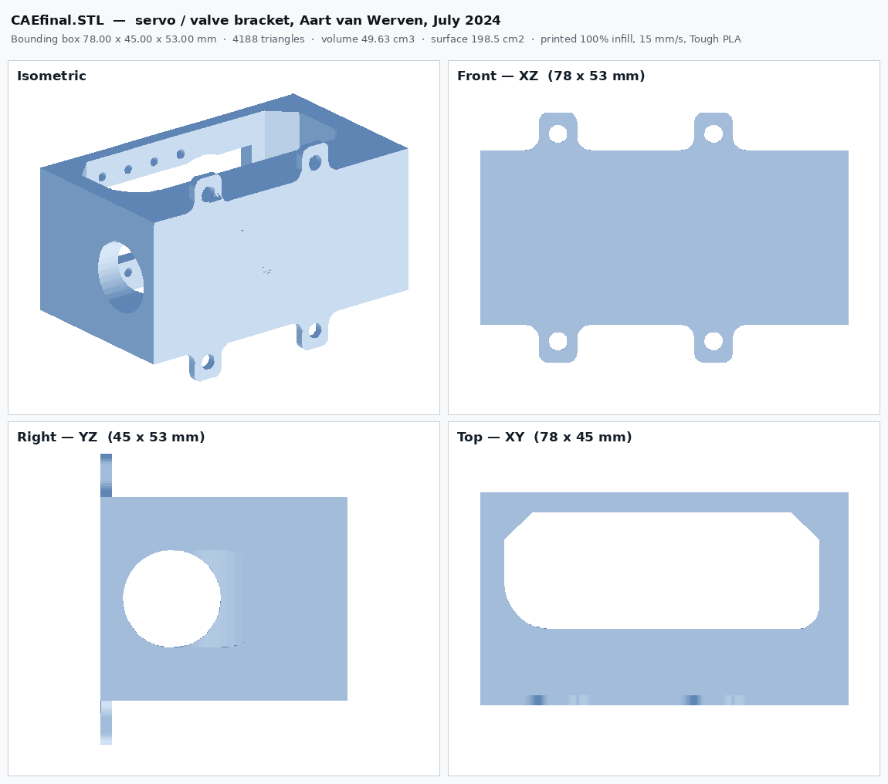

# Compressed-Air Wankel Engine Test Bench

Everything needed to rebuild the compressed-air engine experiment used in
**Mechanical Craftsmanship & Design and Construction** at the Faculty of Science and
Engineering, University of Groningen.

A 3D-printed Wankel rotary engine runs on air from a converted fire-extinguisher
tank. A servo-driven ball valve throttles the inlet. Pressure, flow and shaft speed
are logged, and a PID loop regulates engine speed by commanding the valve.



---

## Read this first

**The 2024 data in this repository is wrong by known, fixed factors.** Speed is a
factor of 4.84 too low and flow is 12.4 times too high, from a counting-window bug in
the acquisition chain. Corrected copies are in `data/processed/`, and the arithmetic
is in [`docs/07_KNOWN_ISSUES.md`](docs/07_KNOWN_ISSUES.md). **Fix defects D1 to D3
before you take a single new measurement.**

**Two gaps remain, and this repository says exactly where they are.** The three
student final reports and the original assembly-manual PDF are not here — download
links are in [`MISSING_FILES.md`](MISSING_FILES.md) §D. And five printed parts, all
of which carry an instrument, have no CAD in any archive and must be redrawn
([`MISSING_FILES.md`](MISSING_FILES.md) §E). Everything mechanical, pneumatic and
electrical that was ever drawn or flashed is in this repository.

---

## Contents

```
CAE-bench/
├── README.md                     you are here
├── MISSING_FILES.md              what to download, what to redraw, what is gone
├── CITATION.cff
├── docs/
│   ├── 01_BILL_OF_MATERIALS.md   pneumatic, mechanical, sensors, actuator, electrical
│   ├── 02_MECHANICAL_ASSEMBLY.md safety, engine build, frame, actuator, torque rig
│   ├── 03_PNEUMATIC_CIRCUIT.md   the air path, operating points, valve area curve
│   ├── 04_ELECTRONICS_AND_WIRING.md  pin map, Dynamixel chain, why 5 V
│   ├── 05_SENSORS_AND_CALIBRATION.md pressure, flow, force, speed resolution
│   ├── 06_SOFTWARE.md            install, run, control law, data format
│   └── 07_KNOWN_ISSUES.md        seven defects, the torque gap, two doc errors
├── cad/
│   ├── README.md                 measured geometry and the print profile
│   ├── aart-2024/                the servo and valve bracket (6 files)
│   ├── wankel-2023/              engine, covers, crank, shaft, pulleys (8 files)
│   │   └── Random/               design iterations and STEP exports (17 files)
│   ├── pneumatics/               sensor adapters and valve frame (5 files)
│   └── torquemeter/              the friction-brake torque rig (11 files)
├── firmware/
│   ├── arduinoADC/               the 2024 acquisition sketch
│   ├── legacy-2024/              the superseded January 2024 sketch
│   └── bench-2023/               calibration, brake and sensor-test sketches (14 files)
├── software/
│   ├── CAEPC.py                  the 2024 PC-side control loop
│   ├── requirements.txt
│   └── matlab/                   the 2023 MATLAB controller and dataset scripts
├── data/
│   ├── raw-2024/                 11 runs as logged, plus their PDF plots
│   └── processed/                the same runs with corrected columns
└── reference/
    ├── assembly_manual_2024.md
    ├── sensor_calibration_procedure_2023.md
    ├── MCDC_Sensor_calibration_procedure.pdf   the original of the above
    └── bench_purchase_record.csv
```

---

## Build it

1. **[Bill of materials](docs/01_BILL_OF_MATERIALS.md)** — order the parts. Budget
   about €300–350 plus €11 of filament for one bench. Two things to get right:
   the bearings are **R188 ZZ 6.35 × 12.7 × 4.76 mm** (the 3.18 mm version was
   superseded), and the bracket screws are **M4**, not the M2 the old report says.
2. **Print the parts.** `cad/wankel-2023/` for the engine, `cad/pneumatics/` for the
   sensor adapters, `cad/aart-2024/` for the servo bracket at 100 % infill, and
   `cad/torquemeter/` if you are building the brake. Redraw the five missing sensor
   mounts — `MISSING_FILES.md` §E lists them.
3. **[Assemble](docs/02_MECHANICAL_ASSEMBLY.md)** — engine first, and it must spin
   freely by hand before anything else is attached.
4. **[Plumb it](docs/03_PNEUMATIC_CIRCUIT.md)** — tank, adapter, pressure tee, flow
   sensor, hand valve, servo valve, engine. Leak-test at 2 bar before going to 8.
5. **[Wire it](docs/04_ELECTRONICS_AND_WIRING.md)** — pressure to A0, flow to D2,
   IR to D3. Those two digital pins are fixed by the Uno's interrupt hardware.
6. **[Calibrate](docs/05_SENSORS_AND_CALIBRATION.md)** — pressure, then flow, then
   force. Do not skip this; the shipped constants are for water.
7. **[Run it](docs/06_SOFTWARE.md)** — flash `arduinoADC.ino`, then
   `python CAEPC.py`. 60-second runs, step the hand valve open at t ≈ 10 s.

---

## Safety

The tank is a repurposed fire extinguisher. **8 bar maximum.** Eye protection
whenever it is charged. The engine reaches roughly 2700 rpm unloaded at the normal
operating point and over 7000 rpm in the high-pressure test; printed parts leaving a
rotor at that speed are dangerous. Aart van Werven's own closing note: *"running the
experiment at full force can not be considered safe, the screws in the current
connecting piece loosen due to the high vibrations and rotational force and get
launched at high speed."* Fit a guard and thread-lock the coupling screws.

---

## Provenance

Four student generations, one bench.

| Year | Who | Contribution |
|---|---|---|
| 2023 | **Koen Kiewiet** | 3D replication of the Wankel and multi-domain characterisation. BSc Integration Project. |
| 2023 | **Niek Hilbrands** | Closed-loop PID speed control and a Simscape digital twin. `Final_PID.m`, `Final_DT.slx`. |
| 2023 | **Jelmer Veenhuizen & Quentin Hopman** | Teaching assistants. The sensor calibration procedure, and the friction-brake torque rig that was never logged. |
| 2024 | **Damien Dufour** | The assembly manual and the engine technical drawings. |
| 2024 | **Aart van Werven** | Electronics rebuild: Raspberry Pi 5 + Arduino ADC, Dynamixel AX-12A, Python control loop, the servo bracket in `cad/aart-2024/`. All data in `data/raw-2024/`. |
| 2023–25 | **Max Kloosterman** | Teaching assistant and hardware custodian; later the pneumatic rover and the microscope valve-area characterisation. |

Supervised by **Mauricio Muñoz-Arias**, ENTEG, Faculty of Science and Engineering,
University of Groningen.

Upstream repository: `github.com/AartCodes/RUG-Pneumatic-Engine-experiment`
(the report cites the old username `Avuxy`).

---

## Contributing to this bench

The three things most worth doing next, in order:

1. **Fix the acquisition** (D1, D2, D4, D6). Timestamp the publish window instead of
   assuming it. This is about ten lines and it makes every future measurement valid.
2. **Wire the load cell.** The cells are bought and fitted, the friction brake is
   printed, the calibration procedure is written. One analog channel and a column in
   the Excel writer closes a gap that three student generations listed as future work.
3. **Reprint the interruptor disc with 10 lobes** instead of 3. Together with (1) this
   takes speed resolution from about 97 rpm to about 29 rpm.

A twenty-second coast-down run — spin up, close the valve, log until it stops — would
also give `b/J` for the shaft directly from the decay slope. No run in the archive
contains one, and it is the only shaft parameter measurable without a torque channel.
